# Probability and Random Processes - Assignment 4

###### Praveen Venkatesh
###### 18110127
 
## Results
5 - 4, 4.6
9 - 4, 4.6

We can see that the NLM filter works very well for images that have salt and pepper noise, but not so well for gaussian noise. The high localized noise in the S&P noise is combated by the NLM filter as it takes the weighted mean colour of neighbourhood windows.

### Gaussian Noise
| Ground Truth  | Gaussian Noised | Gaussian Filter | NLM Filter 
|---|---|---|---|---|
|  |  |  |   | 
|PSNR = |  23.08dB | 26.63dB | 26.34dB |
|MSE = |  319.48 | 141.06 | 151.00 |  
|  |  |  |   | 
|PSNR = |  23.08dB | 26.63dB | 24.95dB |
|MSE = |  319.48 | 141.06 | 207.80 |  
|  |  |  |   | 
|PSNR = |  23.08dB | 26.63dB | 24.95dB |
|MSE = |  319.48 | 141.06 | 207.80 |  
|  |  |  |   | 
|PSNR = |  23.08dB | 26.63dB | 24.95dB |
|MSE = |  319.48 | 141.06 | 207.80 |  
|  |  |  |   | 
|PSNR = |  23.08dB | 26.63dB | 24.95dB |
|MSE = |  319.48 | 141.06 | 207.80 |  
|  | 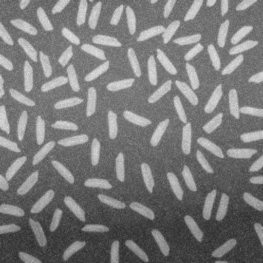 |  |  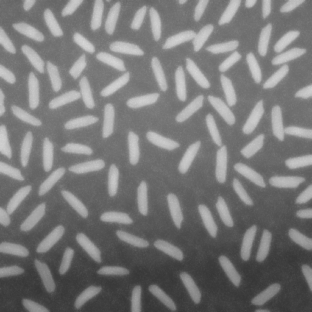 | 
|PSNR = |  23.08dB | 26.63dB | 24.95dB |
|MSE = |  319.48 | 141.06 | 207.80 | 
|  |  |  |   | 
|PSNR = |  23.08dB | 26.63dB | 24.95dB |
|MSE = |  319.48 | 141.06 | 207.80 |  
|  |  |  |   | 
|PSNR = |  23.08dB | 26.63dB | 24.95dB |
|MSE = |  319.48 | 141.06 | 207.80 |  
| 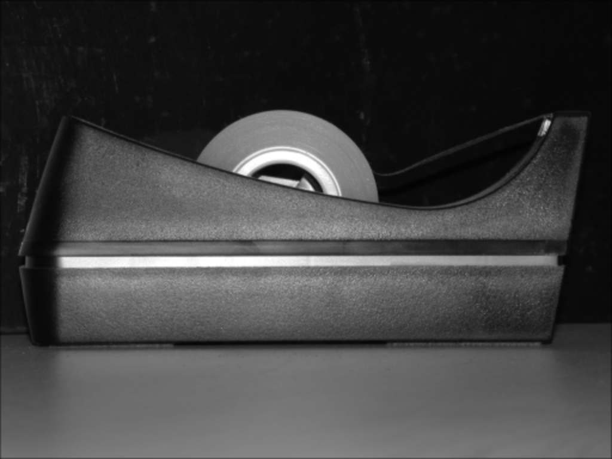 | 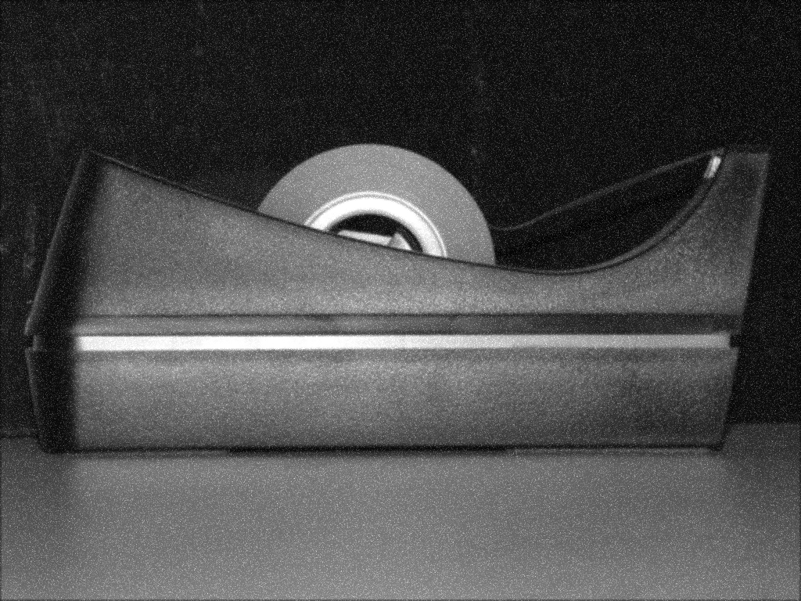 |  |   | 
|PSNR = |  23.08dB | 26.63dB | 24.95dB |
|MSE = |  319.48 | 141.06 | 207.80 |  
| 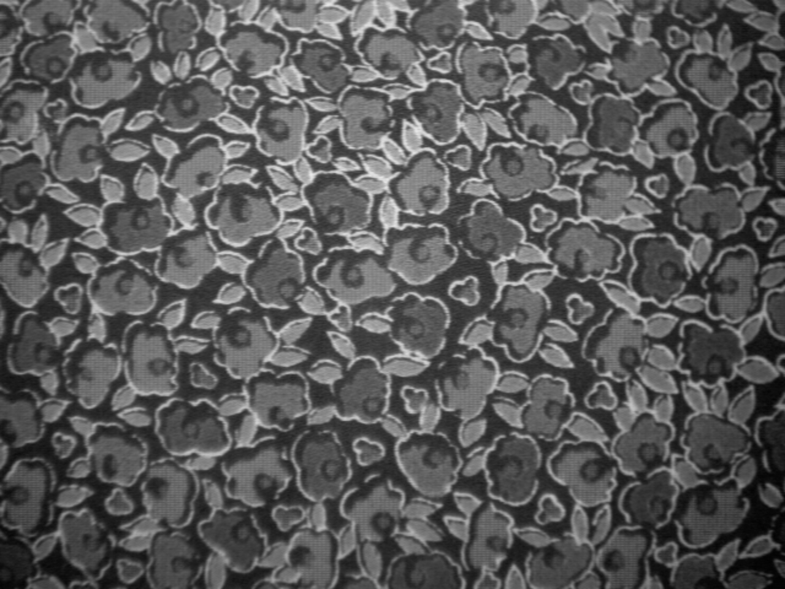 | 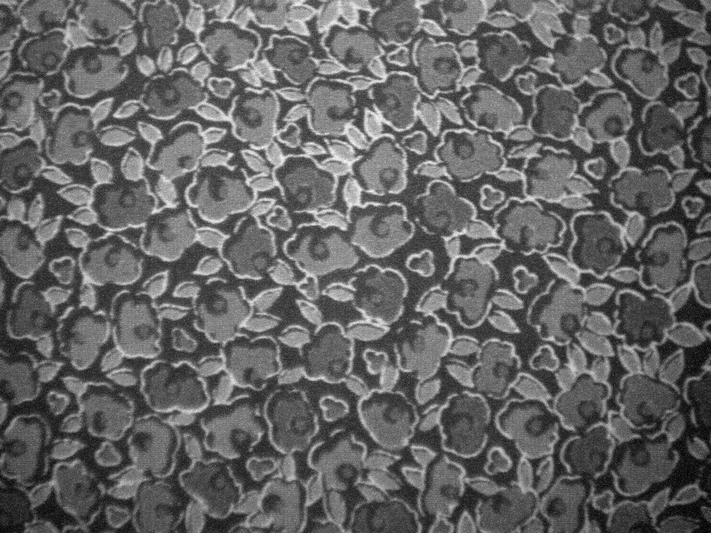 | 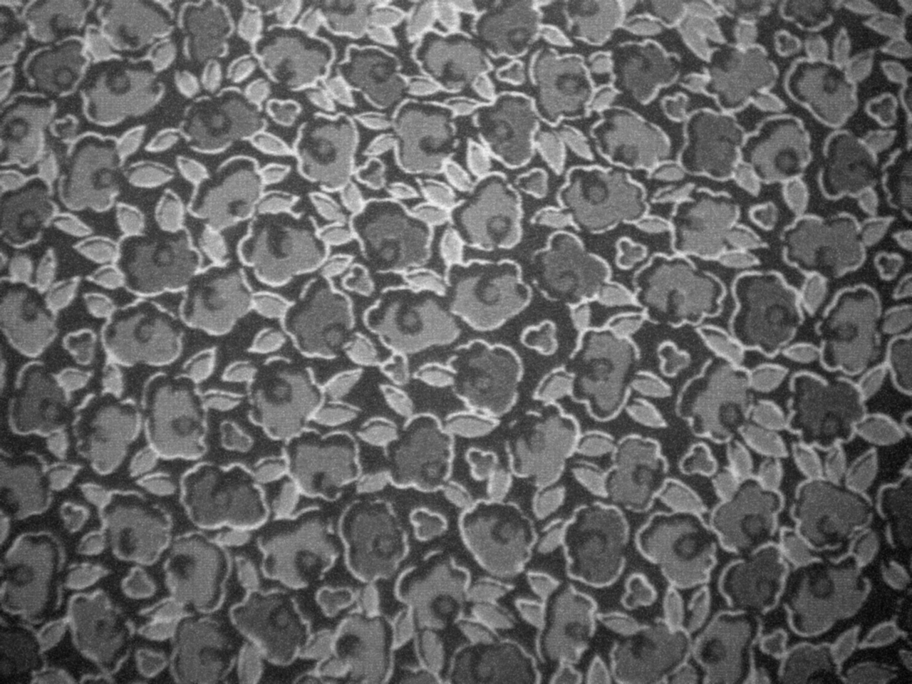 |  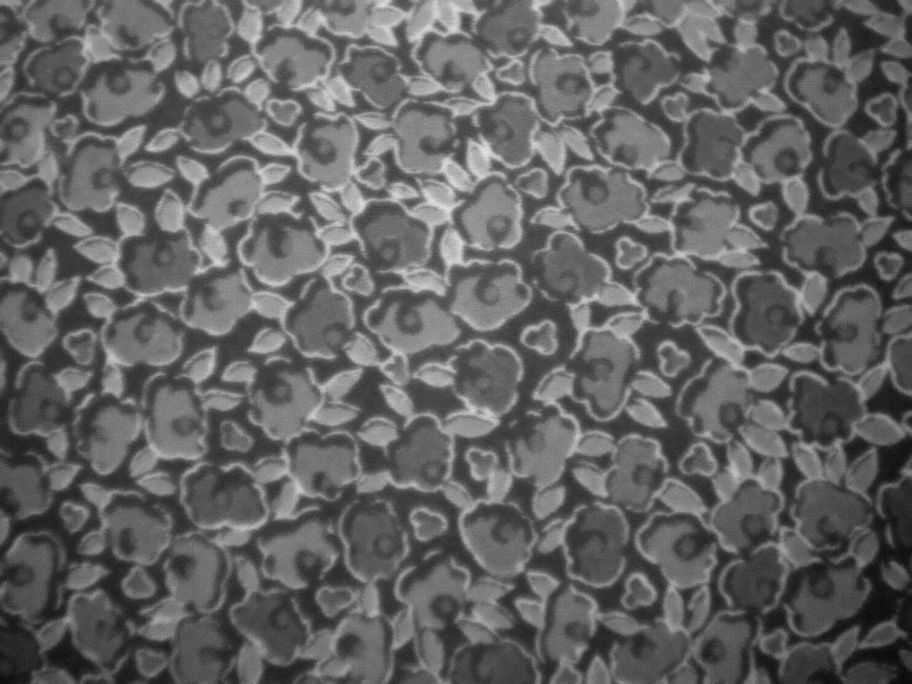 | 
|PSNR = |  23.08dB | 26.63dB | 24.95dB |
|MSE = |  319.48 | 141.06 | 207.80 |  

### Salt and Pepper Noise

| Ground Truth  | S&P Noised | Gaussian Filter | NLM Filter 
|---|---|---|---|---|
|  |  |  |   | 
|PSNR = |  23.07dB | 30.41dB | 35.91dB |
|MSE = |  320.437 | 59.086 | 16.67 |  
|  | 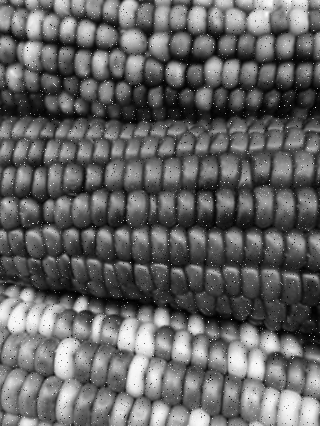 | 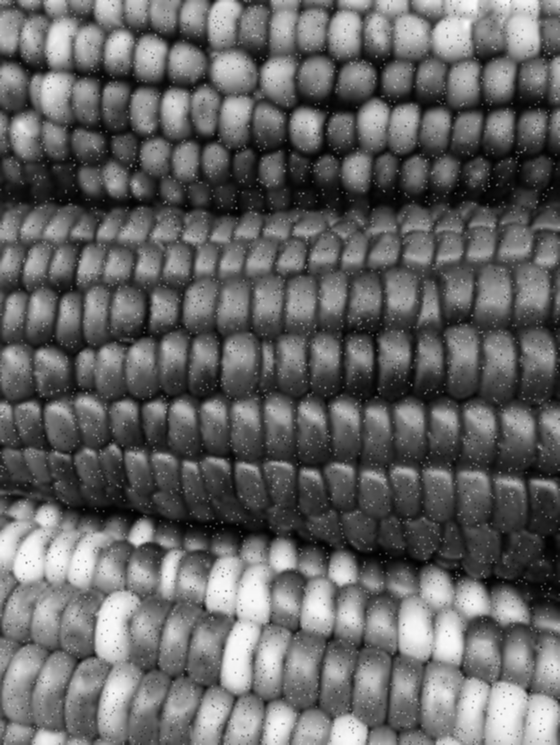 |   | 
|PSNR = |  23.12dB | 26.63dB | 24.95dB |
|MSE = |  319.48 | 141.06 | 207.80 |  
|  |  |  |   | 
|PSNR = |  23.08dB | 26.63dB | 24.95dB |
|MSE = |  319.48 | 141.06 | 207.80 |  
|  |  |  |   | 
|PSNR = |  23.08dB | 26.63dB | 24.95dB |
|MSE = |  319.48 | 141.06 | 207.80 |  
|  |  |  |   | 
|PSNR = |  23.08dB | 26.63dB | 24.95dB |
|MSE = |  319.48 | 141.06 | 207.80 |  
|  |  | 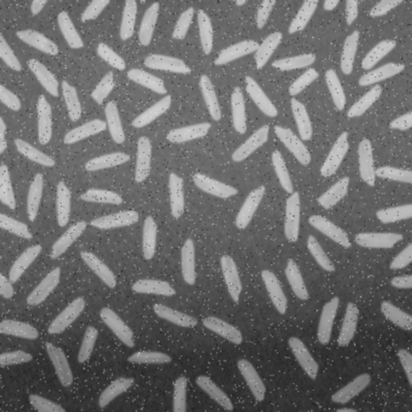 |   | 
|PSNR = |  23.08dB | 26.63dB | 24.95dB |
|MSE = |  319.48 | 141.06 | 207.80 | 
|  |  |  |   | 
|PSNR = |  23.08dB | 26.63dB | 24.95dB |
|MSE = |  319.48 | 141.06 | 207.80 |  
|  |  |  |  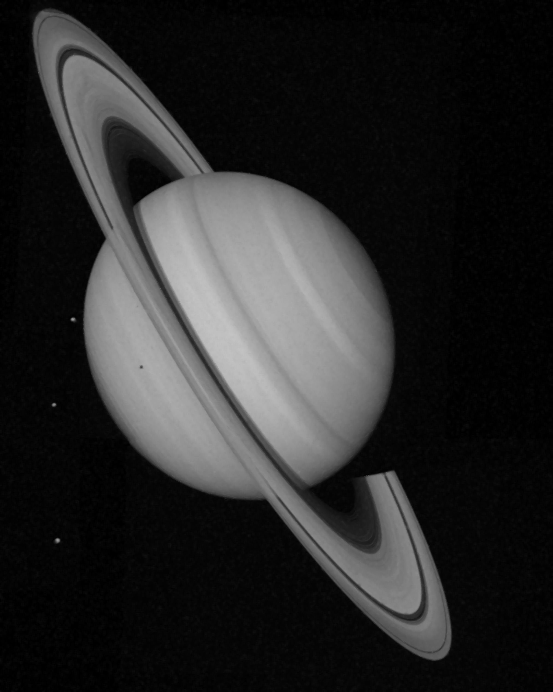 | 
|PSNR = |  23.08dB | 26.63dB | 24.95dB |
|MSE = |  319.48 | 141.06 | 207.80 |  
|  |  |  |   | 
|PSNR = |  23.08dB | 26.63dB | 24.95dB |
|MSE = |  319.48 | 141.06 | 207.80 |  
|  |  | 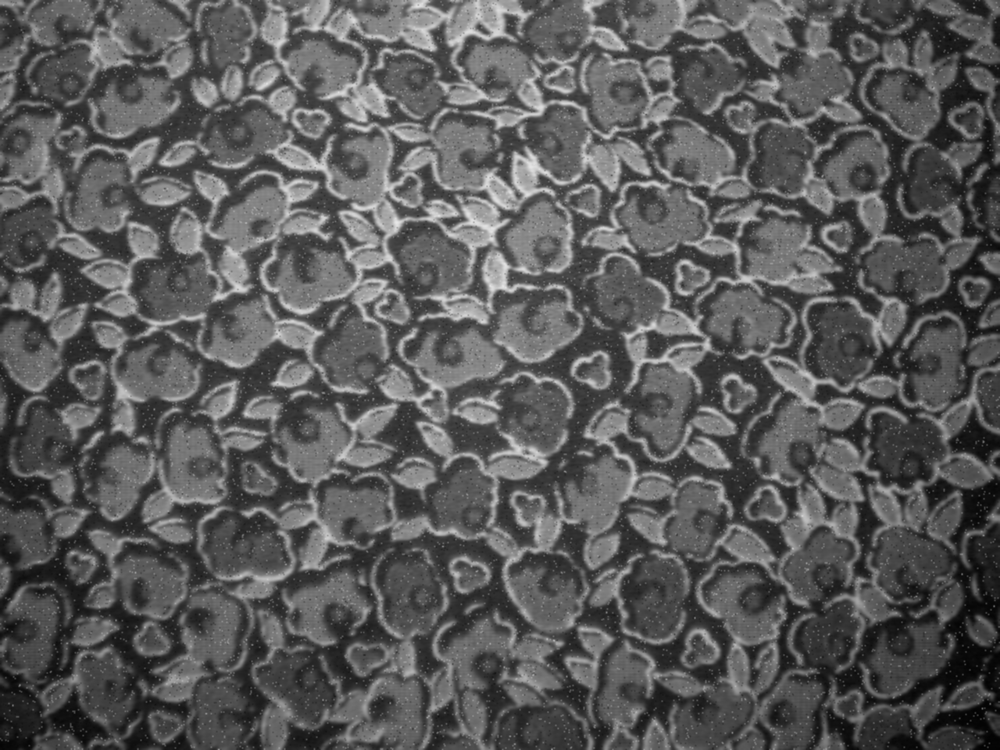 |  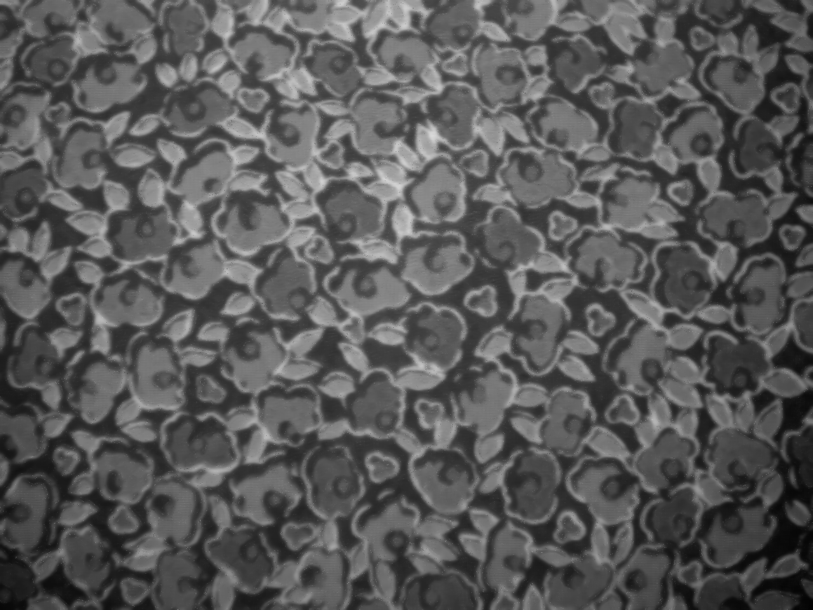 | 
|PSNR = |  23.08dB | 26.63dB | 24.95dB |
|MSE = |  319.48 | 141.06 | 207.80 |  

## PSNR Table

|Index       |Type         |Noisy |Gaussian Filter|NLM Filter|
|------------|-------------|------|---------------|----------|
|1           |Gaussian     |23.07 |26.85          |**27.25**     |
|1           |S&P          |21.96 |30.32          |**35.84**     |
|2           |Gaussian     |23.11 |**26.85**          |25.68     |
|2           |S&P          |21.98 |**30.22**          |29.39     |
|3           |Gaussian     |23.04 |**26.65**          |25.1      |
|3           |S&P          |22.09 |**30.01**          |27.45     |
|4           |Gaussian     |23.14 |**26.85**          |26.37     |
|4           |S&P          |22.24 |30.44          |**30.74**     |
|5           |Gaussian     |23.14 |26.91          |**27.42**     |
|5           |S&P          |20.64 |28.9           |**35.44**     |
|6           |Gaussian     |23.02 |**26.75**          |26.25     |
|6           |S&P          |22.45 |30.63          |**31.9**      |
|7           |Gaussian     |23.07 |**26.78**          |25.95     |
|7           |S&P          |21    |29.16          |**29.51**     |
|8           |Gaussian     |23.02 |26.82          |**27.78**     |
|8           |S&P          |20.72 |29             |_**40.16**_     |
|9           |Gaussian     |23.05 |26.81          |**27.04**     |
|9           |S&P          |21.6  |29.88          |**34.94**     |
|10          |Gaussian     |23.03 |**26.75**          |25.17     |
|10          |S&P          |22.31 |**30.49**          |27.66     |
|11          |Gaussian     |23.06 |26.82          |**26.91**     |
|11          |S&P          |22.5  |30.87          |**33.87**     |

## MSE Table

|Index       |Type         |Noisy |Gaussian Filter|NLM Filter|
|------------|-------------|------|---------------|----------|
|1           |Gaussian     |320.44|134.26         |**122.59**    |
|1           |S&P          |413.69|60.39          |**16.95**     |
|2           |Gaussian     |317.79|**134.16**         |175.77    |
|2           |S&P          |412.47|**61.86**          |74.75     |
|3           |Gaussian     |322.61|**140.69**         |200.95    |
|3           |S&P          |401.53|**64.92**          |117.05    |
|4           |Gaussian     |315.92|**134.42**         |149.96    |
|4           |S&P          |388.41|58.8           |**54.82**     |
|5           |Gaussian     |315.23|132.34         |**117.74**    |
|5           |S&P          |560.78|83.8           |**18.57**     |
|6           |Gaussian     |324.06|**137.35**        |154.33    |
|6           |S&P          |369.97|56.24          |**42.02**    |
|7           |Gaussian     |320.76|**136.62**         |165.25    |
|7           |S&P          |516.57|78.9           |**72.81**     |
|8           |Gaussian     |324.64|135.21         |**108.3**    |
|8           |S&P          |551.34|81.9           |**6.26**      |
|9           |Gaussian     |322.52|135.63         |**128.62**    |
|9           |S&P          |449.65|66.85          |**20.86**     |
|10          |Gaussian     |323.95|**137.54**         |197.56    |
|10          |S&P          |381.78|**58.08**          |111.48    |
|11          |Gaussian     |321.53|135.28         |**132.6**     |
|11          |S&P          |365.49|53.17          |**26.65**     |
