## Image Denoising
###### Praveen Venkatesh

## Usage


- Clone the repository.
- Keep the relevant images under `data/`. Name the images as `Image<index>.png`
- Create the following directories:
```
OUTPUT/GFILTER/
OUTPUT/GT/
OUTPUT/LOGS/
OUTPUT/NLMFILTER/
OUTPUT/NOISED/
```
- Run the `main.py` script from the terminal (make sure the cwd is the extracted folder)
    - This will save all images to the folders that were created in the previous step
    - A log file will also be generated in the `OUTPUT/LOGS/` folder.
- Run the `datacollector.py` script from the terminal.
    - This will collect the data from the logs generated by `main.py` and store in a file called `RESULTS.csv` that can be later read via excel.

## Results


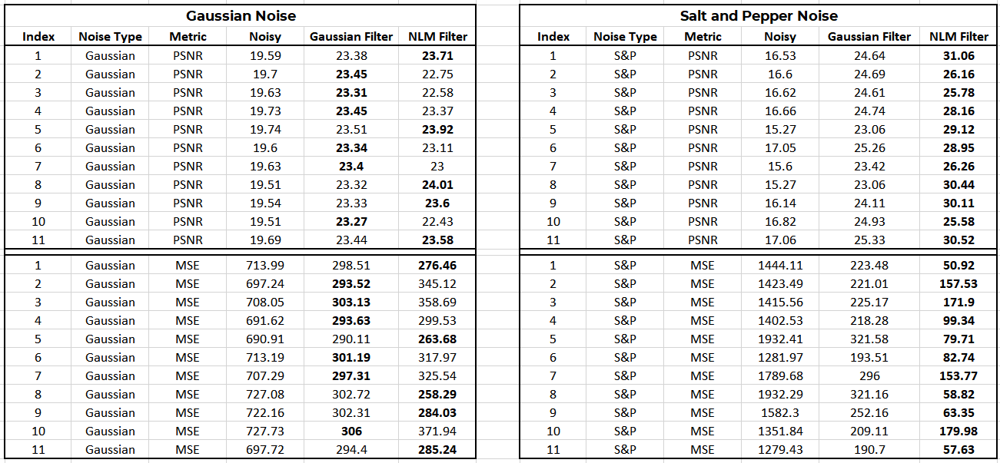


- We notice that the PSNR is improved considerably compared to the noisy image.

- We can clearly see that the NLM denoising method is superior for salt and pepper noise, where it outperforms the Gaussian filter in all images. The high localized noise in the S&P noise is combated by the NLM filter as it takes the weighted mean colour of neighbourhood windows.

- Even though the metrics sometimes indicate that the Gaussian Filter is working well, we notice that the visual quality of the Gaussian Filter is not up to the mark compared to the NLM filter. This is because the gaussian filter simply smoothes out the noise instead of trying to remove them, whereas the NLM denoising method tries to identify similar patches around noise, and tries to eliminate them.


- In conclusion, we can say that the NLM method is superior to the Gaussian filter for salt and pepper noise, whereas both filters work reasonably well for gaussian noise.


## Visual Results

Here are a few visual results obtained after running the algorithm.

|  |  | 
|---|---| 
| 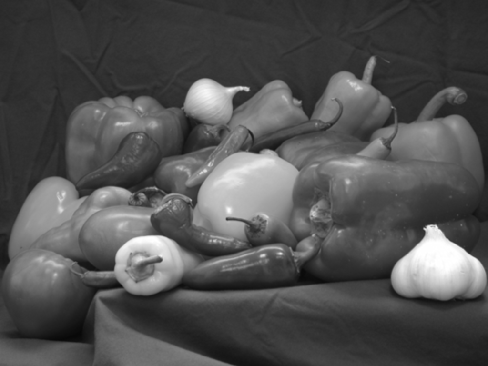 |  | 
| Ground Truth | Ground Truth  |
|  | |
| Gaussian Noise | Salt and Pepper Noise |
| 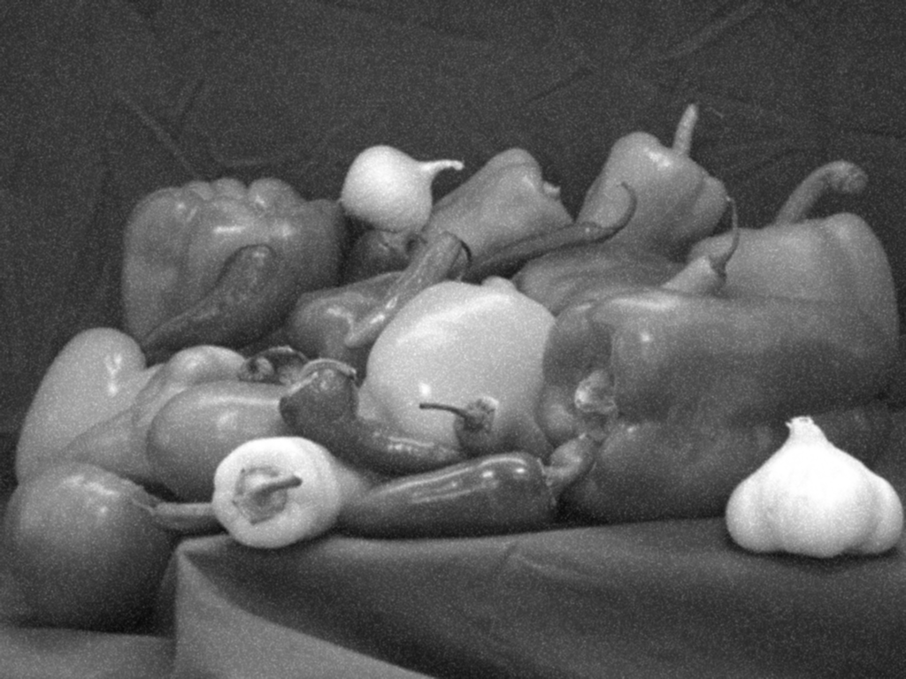 ||
| Gaussian Filter, Gaussian Noise | Gaussian Filter, Salt Noise  |
|  |  |
| NLM Filter, Gaussian Noise | NLM Filter, Salt Noise  |


|  |  | 
|---|---| 
| 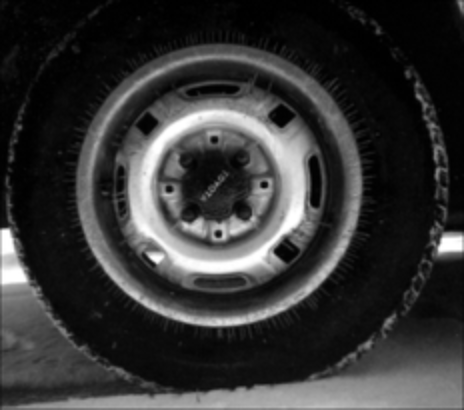 |  | 
| Ground Truth | Ground Truth  |
| 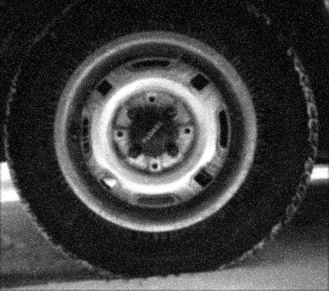 | |
| Gaussian Noise | Salt and Pepper Noise |
|  ||
| Gaussian Filter, Gaussian Noise | Gaussian Filter, Salt Noise  |
| 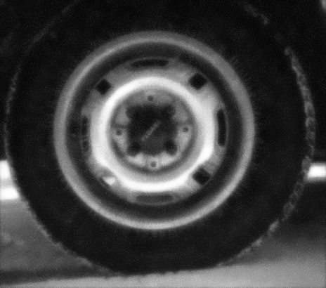 |  |
| NLM Filter, Gaussian Noise | NLM Filter, Salt Noise  |


|  |  | 
|---|---| 
|  |  | 
| Ground Truth | Ground Truth  |
|  | |
| Gaussian Noise | Salt and Pepper Noise |
|  ||
| Gaussian Filter, Gaussian Noise | Gaussian Filter, Salt Noise  |
| 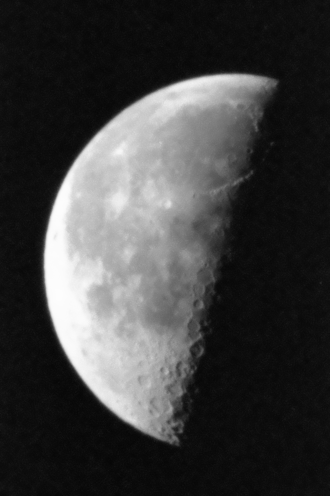 | 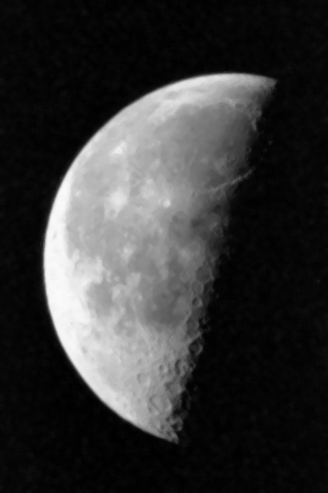 |
| NLM Filter, Gaussian Noise | NLM Filter, Salt Noise  |

|  |  | 
|---|---| 
|  |  | 
| Ground Truth | Ground Truth  |
|  | |
| Gaussian Noise | Salt and Pepper Noise |
| 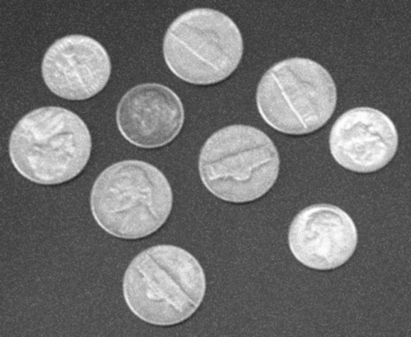 ||
| Gaussian Filter, Gaussian Noise | Gaussian Filter, Salt Noise  |
|  | 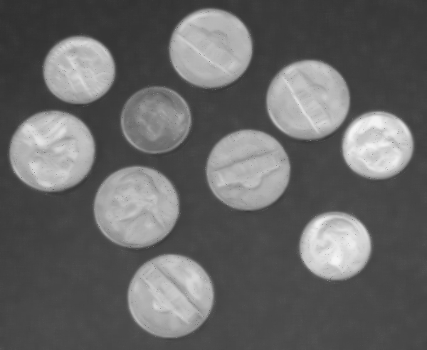 |
| NLM Filter, Gaussian Noise | NLM Filter, Salt Noise  |

|  |  | 
|---|---| 
| 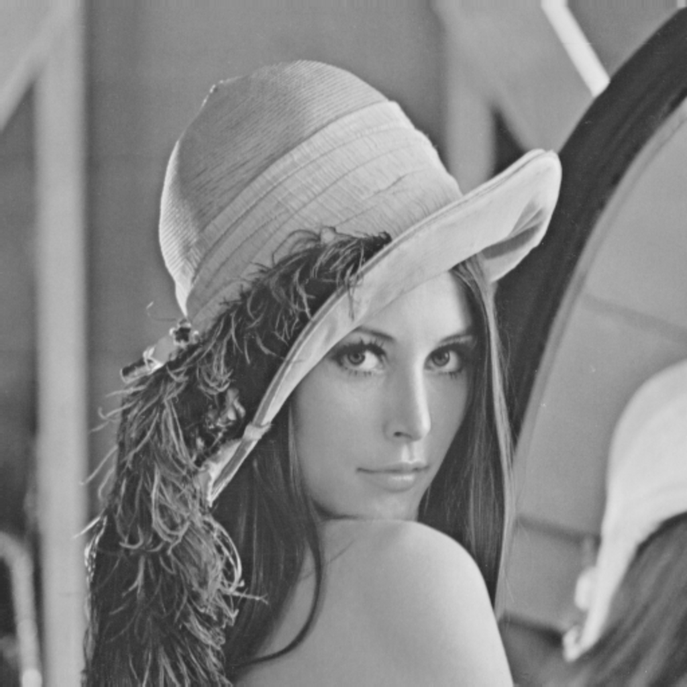 |  | 
| Ground Truth | Ground Truth  |
|  | 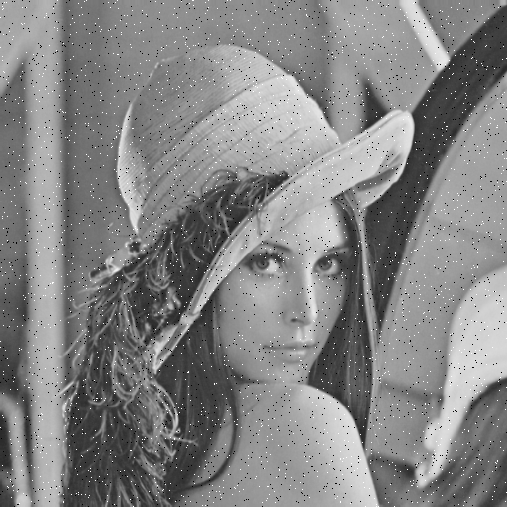|
| Gaussian Noise | Salt and Pepper Noise |
|  ||
| Gaussian Filter, Gaussian Noise | Gaussian Filter, Salt Noise  |
|  |  |
| NLM Filter, Gaussian Noise | NLM Filter, Salt Noise  |


- As we can see from the above images, the results are vastly improved in the case of the NLM filter, where most of the noise is removed. 
- The NLM filter works particularly well in cases where there are large patches of the image with a similar colour. As a consequence, the algorithm works better when the image is scaled up. 
- We also notice that the remaining noise in the image is sharper near edges where there is a transition between surfaces since there is a high variance between the colours.

<div style="page-break-after: always;"></div>

### Implementation Notes

- All images were scaled up by a factor of 2 before performing computations for showing the difference between NLM and Gaussian Filter.
- The results depend on the amount of noise in the image. In some cases where the noise is very high, it is not possible to improve image quality beyond a certain limit as there is not sufficient information to find the missing pixels accurately.
- When taking the weighted pixels, the weights were divided by h instead of h x h. This is done from an experimentation point of view as this gives slightly more control over the tunable parameter as the exponential function decays slower for the same increase in h. The functioning of the algorithm will however remain the same since the order of h will simply change to obtain the same level of filtering.
- The tunable parameters of the NLM filter are the values of the window sizes, and the value of h. To obtain the previous results, fixed values were used for all images.
- An additional image apart from the one given in the dataset was added. This image is the classic `Lena` image used widely in image processing!


### References
[1] A. Buades, B. Coll and J. -. Morel, "A non-local algorithm for image denoising," 2005 IEEE Computer Society Conference on Computer Vision and Pattern Recognition (CVPR'05), San Diego, CA, USA, 2005, pp. 60-65 vol. 2, doi: 10.1109/CVPR.2005.38
[2]  Palou, G. (2015, July 07). An approach to Non-Local-Means denoising. Retrieved November 16, 2020, from http://dsvision.github.io/an-approach-to-non-local-means-denoising.html